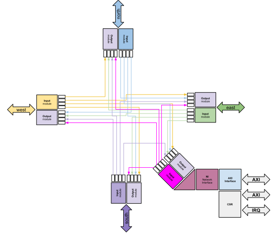

 

# RaveNoC - configurable Network-on-Chip
## Table of Contents
* [Introduction](#intro)
* [uArch description](#uarch)
* [Usage](#usg)
* [FAQ](#faq)
* [Contributions](#contrib)
* [License](#lic)

##  Introduction
RaveNoC is a configurable HDL for mesh NoCs topology that allows the user to define change parameters and setup new configurations. The following parameters are configurable and can be passed by compilation type as system verilog macros. The NoC only supports mesh topology for now but other topologies are beeing studied to make it configurable as well such as torus. All the HDL files are coded in system verilog and they were tested using verilator/xcelium(cadence)/vivado synth, so it's compatible with these tools to build and generate hw configuration. Please check that not all parameters are indicated to change unless to look inside the code to understand how it's used or wants to build something custom for one specific application.

| SV Macro      | Description                                           | Default Value | Range                                               |
|---------------|-------------------------------------------------------|:-------------:|-----------------------------------------------------|
| FLIT_WIDTH    | Total flit width in bits                              |       34      | Min. val == X_WIDTH+Y_WIDTH+PKT_WIDTH+FLIT_TP_WIDTH |
| FLIT_BUFF     | Number of flits buffered in each virtual channel fifo |       4       | Min. val == 1, must be power of 2                   |
| FLIT_TP_WIDTH | Flit Width type                                       |       2       | Not recommended to change unless change the design  |
| N_VIRT_CHN    | Number of virtual channels                            |       3       | Min. val == 1                                       |
| H_PRIORITY    | Priority type on Virtual channels                     |       1       | Priority => [1-High VC ID] / [0-Low VC ID]          |
| NOC_CFG_SZ_X  | NoC size X                                            |       3       | Mesh X dimension                                    |
| NOC_CFG_SZ_Y  | NoC size Y                                            |       4       | Mesh Y dimension                                    |
| ROUTING_ALG   | Routing algorithm of input module of the NoC          |   "X_Y_ALG"   | "X_Y_ALG","Y_X_ALG"                                 |
| MAX_SZ_PKT    | Max number of flits per packet                        |      256      | Min. val == 1                                       |
| MIN_SIZE_FLIT | The smallest flit size                                |       1       | Not recommended to change unless change the design  |

##  HDL micro architecture
The NoC has been constructed in a way that most part of the modules are replicated through generate SV constructions, thus the behavior is generic and it was designed in a way that the user could reuse as much as possible in different hierarchies. Each router is composed by input modules, output modules, one CSR (control and status register), a NI (network interface) and an AXI interface. The diagrams below exemplifies the modules mentioned and how the connections are done at router level.

Through each router, we have 5x output modules and 5x input modules, each one connected to other that are not from the same direction (i.e other 4x ports). One router is capable of routing a packet composed by one (single head flit) or more flits through his ports (west, east, north, south or local). Each port will always select a router for the current flit in the correspondent virtual channel to route but never in the same direction i.e it'll never return from where it came from. This also applies to the local port (the one in diagonal in the previous diagram). So if a flit is pushed through the router it's because it has a destination valid and the flit should move in between the input modules internal FIFOs. Router connections internally are showed below:

###  Input module
One router has exactly 5x input modules, each input module can have one or more virtual channels, each virtual channel has a FIFO inside that's also configurable and it's responsible to store the flits that comes from his input interface. In the case of the router connections of west, east, north, south it's input interface comes from another router, in the local port it'll be from the network interface that's generating the flits. Every time a **head** flit arrives in the input module, the input router inside this module will decode its destination by looking to the current node address of the router and the target one in the header. Depending upon the selected algorithm for the routing, it'll select one of 4x possible output modules. There's no sequential logic latency in the data path from the input to the FIFOs, meaning that once the flit is in the input, in the next clock cycle it'll be stored in the correct FIFO. Also it's important to highlight that each virtual channel has it's own independent FIFO and when a higher priority virtual channel message comes, the lower priority flits are preempted inside their FIFOs, allowing only the highest priority flit pass through. If the FIFOs are full, each independent one will set zero the correspondent *ready* interface signal to generate back pressure on the connections in. If there's space available and the interface has valid signals, then a flit will come through the input module and this module will (in the next clock cycle) for it's route to the output.

###  Output module
The output module has no sequential elements like FFs to store the flits, so it means by that every time a route has been established, it'll connect the correspondent FIFO input module to the next router in the NoC. Each output module has a round-robin arbiter per virtual channel, so in a long time, it'll keep fairness between the different input modules of the same virtual channel. The same concept applied in the input module of preemptive virtual channels is used in the output module, where a flit coming from a higher priority virtual channel will have precedence over the lower ones. Thus the input module routing is responsible for locking the current route by it's own, on each independent virtual channel, once it should be restored after the higher flit has been transferred. 

##  Usage
To connect the NoC in a MPSoC RTL, each slave AXI IF of the Router/Node must be connected to an AXI interconnect of each processing element (local memory map) with at least 32KB of address space for CSR mapping. There's also a macro in SV, that must be set by the user, that's an array of all the nodes vs memory map of location in the MPSoC. With this concept it implies that each processing element of the MPSoC can access the whole memory map (thus all nodes in the NoC) as a *normal slave* in it's own bus. For instance, in a mesh of 10x10 if processing element of the node (7,7) wants to access a DDR controller available in the node (0,0), it can just write to the global address mapping where the node (0,0) is mapped, without carrying if the peripheral it's part of its own local bus or not.

##  License
