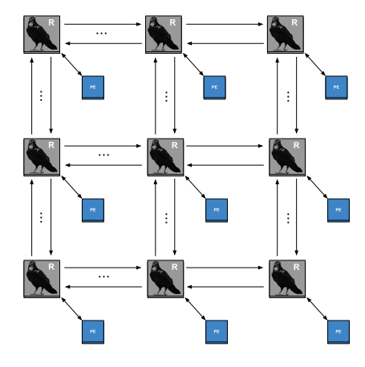

# RaveNoC - configurable Network-on-Chip

## Table of Contents

* [Introduction](#intro)
* [Requirements](#req)
* [Usage](#usg)
* [FAQ](#faq)
* [Contributions](#contrib)
* [License](#lic)
___

##  Introduction

RaveNoC is a configurable HDL for NoCs that allows the user

##  Requirements
##  Usage
##  FAQ
##  Contribution
##  License
