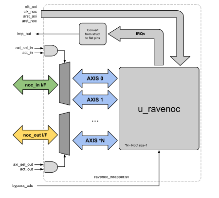

# RaveNoC Testbench

* [RaveNoC wrapper](#rwrapper)
* [Hardware flavors](#hwflavors)
* [Test list](#tlist)
* [Base classes](#bclasses)
* [Create your own test](#addtest)
* [Modules & Versions](#version)

On this folder we have all the tests that are developed for the RaveNoC, so far at this moment we have 8 tests which cover different aspects of the NoC behavior. Inside the folder **common_noc** we have 2 base classes that are used along all the tests to create packets and the testbench itself. All the tests are implemented using [cocotb](https://github.com/cocotb/cocotb) framework, thus in python along with [Verilator](https://github.com/verilator/verilator) as the simulation engine.

```bash
├── common_noc
│   ├── __init__.py
│   ├── constants.py
│   ├── ravenoc_pkt.py
│   └── testbench.py
├── test_all_buffers.py
├── test_irqs.py
├── test_max_data.py
├── test_noc_csr.py
├── test_ravenoc_basic.py
├── test_throughput.py
├── test_virt_chn_qos.py
└── test_wrong_ops.py
```

## <a name="rwrapper"></a> RaveNoC Wrapper

One of the issues during the development stage is that Verilator 4.106 (till now it is the only one that does not break cocotb VPI) [cannot handle easy structs/arrays](https://github.com/cocotb/cocotb/issues/2380) in the top level, thus **RaveNoC** is encapsulated into a wrapper which exports 2 AXI-Slave I/Fs that are used by the testbench. Along with the AXIs, we have some other signals that are driven by the tests to setup the different set of scenarios.



In the image above, it is possible to view all the connections of `ravenoc_wrapper` with the tests. Here is the list of signals and for what they are used:

* **clk_... / arst_...** - Clocks and asynchronous resets;
* **irqs_out** - All the IRQs from all routers inside the NoC, the signals are flatten into a single long array w.r.t to the top `ravenoc` ones because of the issue mentioned previously;
* **axi_sel_in** - Mux selector for the `noc_in_*` interface;
* **act_in** - Enable signal for the mux selection `axi_sel_in`;
* **noc_in_** - AXI interface used to send packets through the NoC (can also be used to receive, it is just naming convention matching);
* **noc_out** - AXI interface used to receive packets from the NoC (can also be used to send, it is just naming convention matching);
* **axi_sel_out** - Mux selector for the `noc_out_*` interface;
* **act_out** - Enable signal for the mux selection `axi_sel_out`;
* **bypass_cdc** - This is a custom input for the tests that bypasses the `async_gp_fifo` used for CDC, when set to 1. It is only implemented to avoid `cocotb` from building another design to test when both AXI, NoC clks are equal;

The `axi_sel_*` signals should never be equal if both `act_*` are set. When cdc is not required, the user should set to 0 the top array parameter `AXI_CDC_REQ` for the respective router and **not use** `bypass_cdc` input. This is the recommended procedure because it forces the instantiation of `async_gp_fifo`. During standard IP usage, `ravenoc_wrapper` must not be part of filelist once it only exists because of the Verilator 4.106 limitations.

## <a name="hwflavors"></a> Hardware flavors

As **RaveNoC** has several system verilog macros that changes the hardware configuration, some set of values are chosen and called as *flavors*. Each flavor represents a different hardware where all the tests described in the sections below will be executed. The list of flavors and the values are described on the following table:

| Parameters/Flavors |     Vanilla     |     Coffee     |    Liquorice    |
|:------------------:|:---------------:|:--------------:|:---------------:|
|   FLIT_DATA_WIDTH  |        32       |       64       |        64       |
|     ROUTING_ALG    |     X_Y_ALG     |     Y_X_ALG    |     X_Y_ALG     |
|   NOC_CFG_SZ_ROWS  |        2        |        4       |        8        |
|   NOC_CFG_SZ_COLS  |        2        |        4       |        8        |
|      FLIT_BUFF     |        1        |        2       |        3        |
|     MAX_SZ_PKT     |       256       |       256      |       256       |
|     N_VIRT_CHN     |        2        |        3       |        4        |
|     H_PRIORITY     | ZERO_HIGH_PRIOR | ZERO_LOW_PRIOR | ZERO_HIGH_PRIOR |

## <a name="tlist"></a> Test list

The following test list tries to cover different aspects of operation of the NoC, from the basic test #1 till a long test like the #5 which writes/reads to all buffers of all routers. Inside each python script there is a better description of the functional behavior of each individual test.

| Test ID |      Test name     |                                       Short description                                       |
|:-------:|:------------------:|:---------------------------------------------------------------------------------------------:|
|    1    | test_ravenoc_basic | Basic test that sends a packet over the NoC and checks it                                     |
|    2    |   test_wrong_ops   | Checks if the AXI-S/NoC is capable of throwing an errors when illegal operations are executed |
|    3    |    test_max_data   | Test if the NoC is capable to transfer a pkt with the max. size                               |
|    4    |   test_throughput  | Test to compute the max throughput of the NoC                                                 |
|    5    |  test_all_buffers  | Test if all buffers of all routers are able to transfer flits                                 |
|    6    |  test_virt_chn_qos | Test the QoS of VCs in the NoC                                                                |
|    7    |    test_noc_csr    | Check all WR/RD CSRs inside the NoC                                                           |
|    8    |      test_irqs     | Test that checks the IRQs modes inside the NoC                                                |

### Test corners
All the tests are implemented using the [**TestFactory**](https://docs.cocotb.org/en/latest/library_reference.html?highlight=testfactory#cocotb.regression.TestFactory) feature from `cocotb`. This class will generate a set of tests based on the different permutation of all the [options](https://docs.cocotb.org/en/latest/library_reference.html?highlight=testfactory#cocotb.regression.TestFactory.add_option) passed. It is used as well an [AXI master simulation model](https://github.com/alexforencich/cocotbext-axi) that implements the AXI4 protocol driving both AXI I/F (noc_in, noc_out), these objects are created in the [testbench class](https://github.com/aignacio/ravenoc/blob/master/tb/common_noc/testbench.py#L40-L41) explained late. In the RaveNoC the set of test options implemented are:

1. Clock configuration - AXI clk slower/equal/higher than the NoC;
2. With the AXI Master VIP inserting idle cycles on M->S flow channels (AW-write addr,AR-read addr,W-write data) during the transfers;
3. With the AXI Master VIP inserting back pressure on S->M flow channels (B-write response,R-read data);

With the options above, for instance, let's consider the test id #1:
```python
... Lines 47-51
if cocotb.SIM_NAME:
    factory = TestFactory(run_test)
    factory.add_option("config_clk", ["AXI_slwT_NoC", "NoC_slwT_AXI", "NoC_equal_AXI"])
    factory.add_option("idle_inserter", [None, cycle_pause])
    factory.add_option("backpressure_inserter", [None, cycle_pause])
    factory.generate_tests()
```
This will generate the following set of tests:
```
1.  AXI_slwT_NoC_no_idle_no_backpressure
2.  AXI_slwT_NoC_no_idle_w_backpressure
3.  AXI_slwT_NoC_w_idle_no_backpressure
4.  AXI_slwT_NoC_w_idle_w_backpressure
5.  NoC_equal_AXI_no_idle_no_backpressure
6.  NoC_equal_AXI_no_idle_w_backpressure
7.  NoC_equal_AXI_w_idle_no_backpressure
8.  NoC_equal_AXI_w_idle_w_backpressure
9.  NoC_slwT_AXI_no_idle_no_backpressure
10. NoC_slwT_AXI_no_idle_w_backpressure
11. NoC_slwT_AXI_w_idle_no_backpressure
12. NoC_slwT_AXI_w_idle_w_backpressure
```
Although we have three corners to explore on every test, for a functional point of view, does not make sense to run some corners depending of what is intended to explore. For instance in the throughput test #4, having the back pressure / idle cycles corner it is unnecessary, once the intention is to explore the maximum bandwidth of the NoC. Due to this aspect, the table below shows for every test which corners are being exercised or not.

| Test ID |      Test name     | AYI sl. NoC | NoC sl. AYI | NoC equal AYI | No idle cycles | W/ idle cycles | No backpressure | W/ backpressure |
|:-------:|:------------------:|:-----------:|:-----------:|:-------------:|:--------------:|:--------------:|:---------------:|:---------------:|
|    1    | test_ravenoc_basic |      Y      |      Y      |       Y       |        Y       |        Y       |        Y        |        Y        |
|    2    |   test_wrong_ops   |      Y      |      Y      |       Y       |        Y       |        Y       |        Y        |        Y        |
|    3    |    test_maY_data   |      Y      |      Y      |       Y       |        Y       |        Y       |        Y        |        Y        |
|    4    |   test_throughput  |      Y      |      Y      |       Y       |        -       |        -       |        -        |        -        |
|    5    |  test_all_buffers  |      Y      |      Y      |       Y       |        Y       |        Y       |        Y        |        Y        |
|    6    |  test_virt_chn_qos |      Y      |      Y      |       Y       |        -       |        -       |        -        |        -        |
|    7    |    test_noc_csr    |      Y      |      Y      |       Y       |        Y       |        Y       |        Y        |        Y        |
|    8    |      test_irqs     |      Y      |      Y      |       Y       |        Y       |        Y       |        Y        |        Y        |

All the corners mentioned will be executed for all the flavors listed previously. So in summary, we have a total of 144 tests running in the full regression.
```
- 6 tests running all the 7 corners = 42
- 2 tests running 3 corners = 6
= 48 test per flavor
------------------
- 3 flavors (vanilla, coffee, liquorice) - 144 tests
```
### Logs
Each test will run the same sequence described in `run_test` function. For every corner there is a specific log file created (every time a new `Tb` obj is created) although the waveforms file is shared between all corners of each test, i.e all the set of tests above will dump the waves to the same [`dump.fst`](https://github.com/aignacio/ravenoc/blob/master/tb/common_noc/testbench.py#L40-L41) file. Because of this detail, the logs will have the relative timestamp when they run, see the one below.
```bash
140.00ns INFO     ..I_slwT_NoC_no_idle_w_backpressure        testbench.py:35   in __init__                        ------------[LOG - 01_Apr_2021_22h_53m_25s_1617314005.172996]------------
140.00ns INFO     ..I_slwT_NoC_no_idle_w_backpressure        testbench.py:36   in __init__                        SEED: 1617314004
140.00ns INFO     ..I_slwT_NoC_no_idle_w_backpressure        testbench.py:37   in __init__                        Log file: sim_AXI_slwT_NoC_no_idle_w_backpressure
...
```
As it is possible to check, the first statement logged there happens at 140ns due to the fact this is the corner (2.) for the test running. Log files will be located inside the `run_dir` folder created during the simulation where a symbolic link will point to the latest one of each corner (this symlink starts with *latest_sim...*).

In the log files there is also the random seed used to generate the random values and the NoC configuration with the selected parameters.

## <a name="version"></a> Modules & Versions

All the tests are written using the following versions of the dependencies (python modules). It might work or not with newer versions but in the worst case, try with the ones below used during the development.

|  Dependencies | Version |
|:-------------:|:-------:|
| cocotb-bus    |  0.1.1  |
| cocotbext-axi |  0.1.10 |
| cocotb-test   |  0.2.0  |
| cocotb        |  1.5.1  |
| verilator     |  4.106  |
